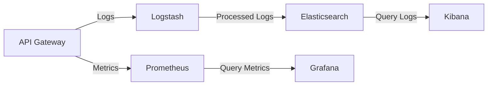
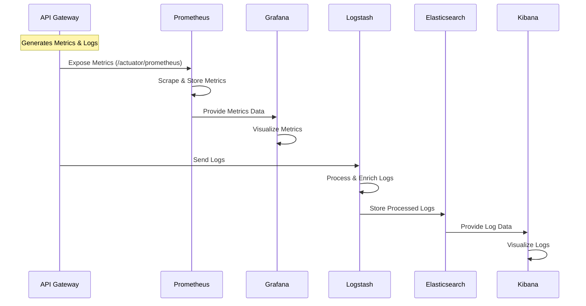
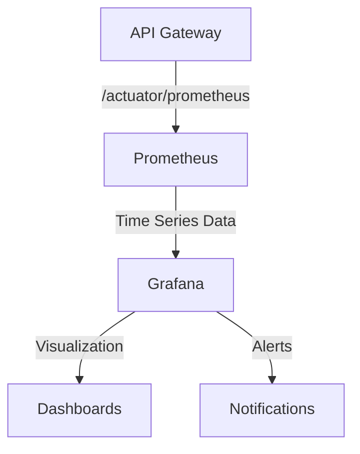
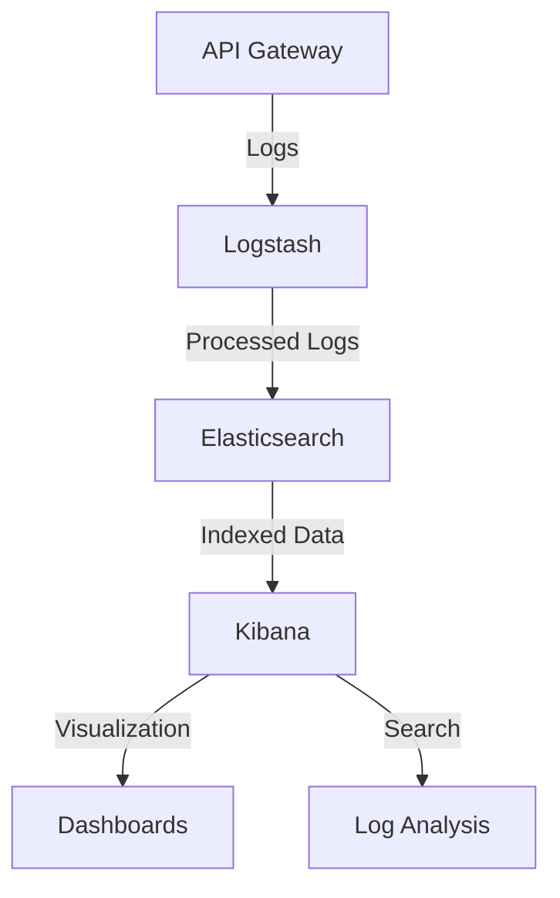
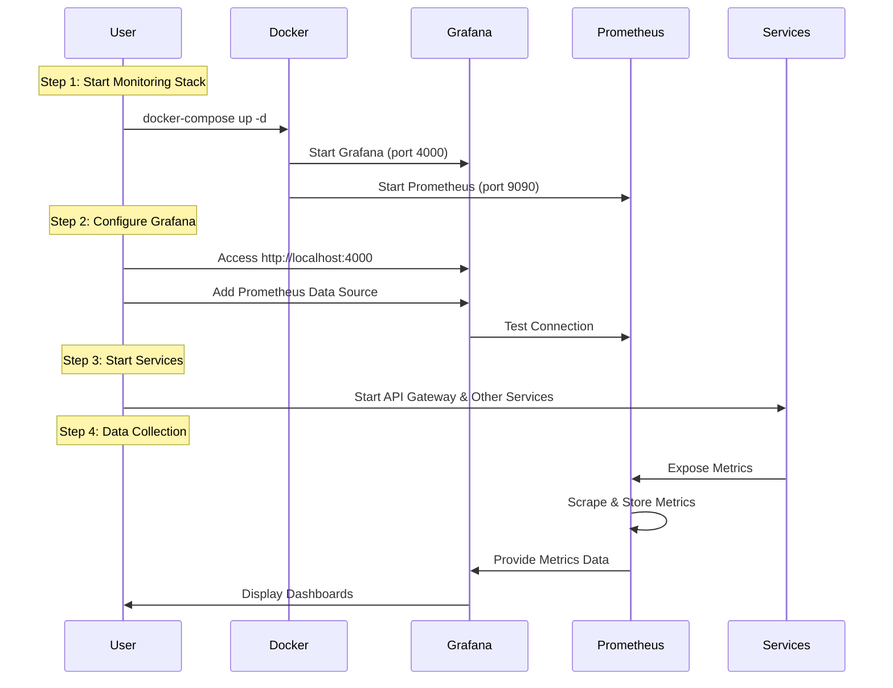
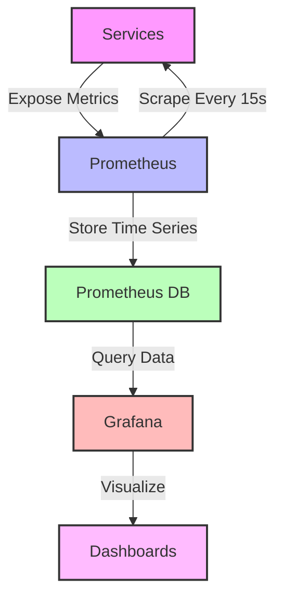
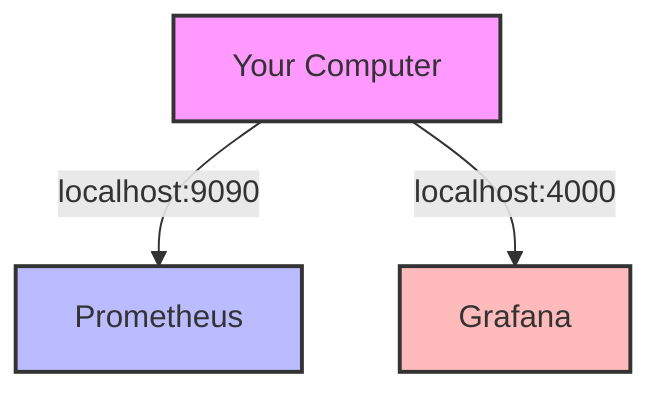
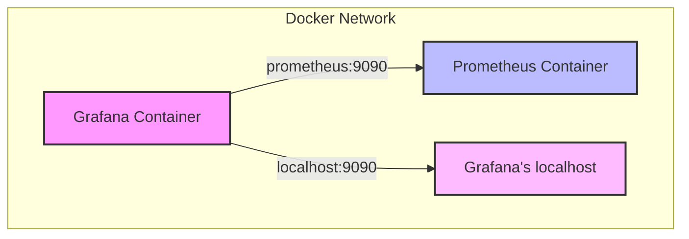
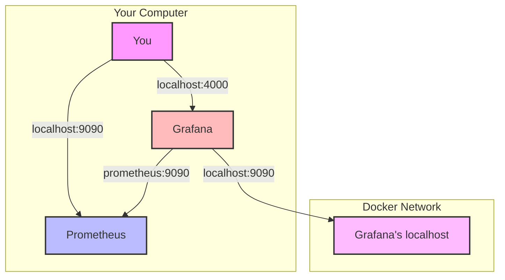
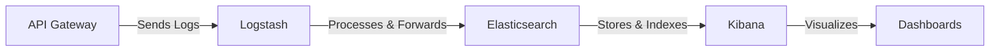

# FamilyHub Monitoring Stack

## Table of Contents
1. [Components](#components)
2. [Getting Started](#getting-started)
3. [Docker Networking Concepts](#docker-networking-concepts)
4. [Grafana Metrics Guide](#grafana-metrics-guide)
5. [Default Spring Boot Metrics](#default-spring-boot-metrics)
6. [Verification Steps](#verification-steps)
7. [Troubleshooting](#troubleshooting)
8. [Best Practices](#best-practices)

This directory contains the monitoring infrastructure for FamilyHub, including log management (ELK Stack) and metrics monitoring (Prometheus + Grafana).

## Components

### 1. ELK Stack (Log Management)
- **Elasticsearch**: Distributed search and analytics engine
  - Port: 9200 (HTTP API)
  - Port: 9300 (Transport)
  - Stores and indexes logs
  - Provides RESTful API for querying

- **Logstash**: Log processing pipeline
  - Port: 5044
  - Collects logs from API Gateway
  - Transforms and enriches log data
  - Forwards to Elasticsearch

- **Kibana**: Data visualization platform
  - Port: 5601
  - Web interface for log analysis
  - Creates dashboards and visualizations
  - Enables log searching

### 2. Metrics Monitoring
- **Prometheus**: Metrics collection and storage
  - Port: 9090
  - Scrapes metrics from API Gateway
  - Stores time-series data
  - Provides query interface

- **Grafana**: Metrics visualization
  - Port: 4000
  - Creates monitoring dashboards
  - Configures alerts
  - Visualizes Prometheus data

## Getting Started

### Prerequisites
- Docker
- Docker Compose
- At least 4GB of RAM available

### Starting the Monitoring Stack
```bash
# Start all services in detached mode
docker-compose up -d

# Verify all services are running
docker-compose ps
```

### Accessing the Services
- Kibana: http://localhost:5601
- Grafana: http://localhost:4000
- Prometheus: http://localhost:9090
- Elasticsearch: http://localhost:9200

## Common Commands

### Container Management
```bash
# Start all services
docker-compose up -d

# Stop all services
docker-compose down

# Restart all services
docker-compose restart

# Restart specific service
docker-compose restart prometheus

# View running containers
docker-compose ps

# View container status
docker-compose ps --format "table {{.Name}}\t{{.Status}}\t{{.Ports}}"
```

### Logs
```bash
# View logs of all services
docker-compose logs -f

# View logs of specific service
docker-compose logs -f elasticsearch
docker-compose logs -f prometheus
docker-compose logs -f grafana

# View last 100 lines of logs
docker-compose logs --tail=100 -f
```

### Maintenance
```bash
# Remove all containers and volumes
docker-compose down -v

# Rebuild specific service
docker-compose up -d --build prometheus

# Check service health
curl http://localhost:9200/_cluster/health  # Elasticsearch
curl http://localhost:9090/-/healthy        # Prometheus
```

### Troubleshooting
```bash
# Check container logs
docker-compose logs -f [service-name]

# Check container status
docker-compose ps [service-name]

# Restart specific service
docker-compose restart [service-name]

# View container resource usage
docker stats
```

## Configuration Files

### 1. docker-compose.yml
- Main configuration file for all services
- Defines services, networks, and volumes
- Manages container dependencies

### 2. prometheus/prometheus.yml
- Prometheus configuration
- Defines scrape targets and intervals
- Configures metric collection

### 3. logstash/config/logstash.conf
- Logstash pipeline configuration
- Defines input, filter, and output plugins
- Configures log processing

## Monitoring Dashboards

### Grafana Dashboards
1. API Gateway Metrics
   - Request rates
   - Response times
   - Error rates
   - Resource usage

2. System Health
   - Service availability
   - Resource utilization
   - Error tracking

### Kibana Dashboards
1. API Gateway Logs
   - Request patterns
   - Error analysis
   - User activity

2. System Logs
   - Service logs
   - Error tracking
   - Performance analysis

## Docker Volumes

Docker volumes are used to persist data generated by and used by Docker containers. They are essential for maintaining data across container restarts and updates.

### Volumes in Our Stack

1. **elasticsearch-data**
   - Purpose: Stores Elasticsearch indices and data
   - Location: `/usr/share/elasticsearch/data`
   - Importance: 
     - Preserves log data between container restarts
     - Maintains search indices
     - Prevents data loss during updates

2. **prometheus-data**
   - Purpose: Stores Prometheus time-series data
   - Location: `/prometheus`
   - Importance:
     - Maintains historical metrics
     - Preserves alert rules
     - Keeps configuration changes

3. **grafana-data**
   - Purpose: Stores Grafana dashboards and configurations
   - Location: `/var/lib/grafana`
   - Importance:
     - Saves custom dashboards
     - Preserves user settings
     - Maintains alert configurations

### Volume Management Commands
```bash
# List all volumes
docker volume ls

# Inspect a specific volume
docker volume inspect elasticsearch-data

# Remove unused volumes
docker volume prune

# Backup volume data
docker run --rm -v elasticsearch-data:/source -v $(pwd)/backup:/backup alpine tar -czf /backup/elasticsearch-backup.tar.gz -C /source .

# Restore volume data
docker run --rm -v elasticsearch-data:/target -v $(pwd)/backup:/backup alpine sh -c "rm -rf /target/* && tar -xzf /backup/elasticsearch-backup.tar.gz -C /target"
```

### Volume Best Practices

1. **Regular Backups**
   - Schedule regular backups of volume data
   - Store backups in a secure location
   - Test backup restoration process

2. **Monitoring**
   - Monitor volume disk usage
   - Set up alerts for low disk space
   - Implement log rotation policies

3. **Security**
   - Restrict volume access permissions
   - Encrypt sensitive data
   - Regular security audits

4. **Maintenance**
   - Regular cleanup of old data
   - Monitor volume performance
   - Implement retention policies

## Best Practices

1. **Resource Management**
   - Monitor container resource usage
   - Adjust memory limits if needed
   - Use volume mounts for persistence

2. **Security**
   - Change default passwords
   - Use secure networks
   - Regular updates

3. **Maintenance**
   - Regular log rotation
   - Backup important data
   - Monitor disk usage

## Troubleshooting Guide

### Common Issues

1. **Service Not Starting**
   ```bash
   # Check logs
   docker-compose logs -f [service-name]
   
   # Check container status
   docker-compose ps
   ```

2. **Connection Issues**
   ```bash
   # Check network
   docker network ls
   docker network inspect monitoring-network
   ```

3. **High Resource Usage**
   ```bash
   # Check resource usage
   docker stats
   
   # Adjust memory limits in docker-compose.yml
   ```

## Support

For issues or questions:
1. Check the logs
2. Review configuration files
3. Consult documentation
4. Contact the development team

## License

This monitoring stack is part of the FamilyHub project and is subject to the project's license terms.

## Monitoring Architecture

### System Overview


### Data Flow


## Setup Guide

### 1. Starting the Stack
```bash
# Start all services
docker-compose up -d

# Verify services are running
docker-compose ps
```

### 2. Grafana Setup

#### 2.1 Add Prometheus Data Source
1. Open Grafana (http://localhost:4000)
2. Go to Connections → Data Sources
3. Click "Add data source"
4. Select "Prometheus"
5. Configure:
   - Name: Prometheus
   - URL: http://prometheus:9090
   - Access: Server (default)
6. Click "Save & Test"

#### 2.2 Create Dashboard
1. Click "+" → "Create Dashboard"
2. Add new panel
3. Configure metrics:
   ```promql
   # Request Rate
   rate(http_server_requests_seconds_count[5m])
   
   # Response Time
   rate(http_server_requests_seconds_sum[5m]) / rate(http_server_requests_seconds_count[5m])
   
   # Error Rate
   rate(http_server_requests_seconds_count{status=~"5.."}[5m])
   ```

### 3. Kibana Setup

#### 3.1 Create Index Pattern
1. Open Kibana (http://localhost:5601)
2. Go to Stack Management → Index Patterns
3. Create index pattern:
   - Pattern: api-gateway-*
   - Time field: @timestamp

#### 3.2 Create Visualizations
1. Go to Visualize
2. Create visualization:
   - Log volume over time
   - Error distribution
   - Response time patterns

### 4. Verify Data Collection

#### 4.1 Prometheus
- Open http://localhost:9090
- Go to Status → Targets
- Verify API Gateway is "UP"
- Check metrics in Graph view

#### 4.2 Elasticsearch
- Open http://localhost:9200
- Check indices:
  ```bash
  curl http://localhost:9200/_cat/indices
  ```

## Monitoring Components

### 1. Metrics Pipeline


### 2. Logging Pipeline


## Common Metrics

### API Gateway Metrics
1. **Request Metrics**
   - Total requests
   - Request rate
   - Response time
   - Error rate

2. **System Metrics**
   - CPU usage
   - Memory usage
   - Thread count
   - JVM metrics

3. **Business Metrics**
   - Active users
   - Request patterns
   - Error types
   - Performance trends

## Troubleshooting

### Common Issues

1. **Prometheus Not Collecting Data**
   ```bash
   # Check Prometheus targets
   curl http://localhost:9090/api/v1/targets
   
   # Verify API Gateway endpoint
   curl http://localhost:8090/actuator/prometheus
   ```

2. **Logstash Not Processing Logs**
   ```bash
   # Check Logstash logs
   docker-compose logs -f logstash
   
   # Verify Elasticsearch connection
   curl http://localhost:9200/_cluster/health
   ```

3. **Grafana No Data**
   - Verify Prometheus data source
   - Check query syntax
   - Verify time range
   - Check data source permissions

## Setup Flow and Data Collection

### Initial Setup Sequence


### Detailed Setup Instructions

#### 1. Start Monitoring Stack
```bash
# Start all monitoring services
docker-compose up -d

# Verify services are running
docker-compose ps
```

#### 2. Configure Grafana
1. Access Grafana:
   - Open http://localhost:4000
   - Default credentials: admin/admin
   - Change password when prompted

2. Add Prometheus Data Source:
   - Go to Configuration → Data Sources
   - Click "Add data source"
   - Select "Prometheus"
   - Configure:
     ```
     Name: Prometheus
     URL: http://prometheus:9090
     Access: Server (default)
     ```
   - Click "Save & Test"
   - Verify "Data source is working" message

3. Create Initial Dashboard:
   - Click "+" → "Create Dashboard"
   - Add new panel
   - Select Prometheus data source
   - Add basic metrics:
     ```promql
     # Request Rate
     rate(http_server_requests_seconds_count[5m])
     
     # Response Time
     rate(http_server_requests_seconds_sum[5m]) / rate(http_server_requests_seconds_count[5m])
     ```

#### 3. Start Services
1. Start API Gateway:
   ```bash
   # Start API Gateway
   ./mvnw spring-boot:run
   ```

2. Verify Metrics Endpoint:
   ```bash
   # Check if metrics are exposed
   curl http://localhost:8090/actuator/prometheus
   ```

#### 4. Data Collection Flow


### Verifying Data Collection

#### 1. Check Prometheus Targets
1. Open http://localhost:9090
2. Go to Status → Targets
3. Verify services are "UP"
4. Check last scrape time and errors

#### 2. Verify Grafana Data
1. Open your dashboard
2. Check if metrics are appearing
3. Verify time range
4. Check for any errors in panel

#### 3. Common Issues and Solutions

1. **No Data in Grafana**
   ```bash
   # Check Prometheus targets
   curl http://localhost:9090/api/v1/targets
   
   # Verify service metrics endpoint
   curl http://localhost:8090/actuator/prometheus
   
   # Check Prometheus logs
   docker-compose logs -f prometheus
   ```

2. **Prometheus Connection Issues**
   ```bash
   # Test Prometheus health
   curl http://localhost:9090/-/healthy
   
   # Check network connectivity
   docker network inspect monitoring-network
   ```

3. **Service Metrics Not Exposed**
   - Verify service is running
   - Check actuator endpoints are enabled
   - Verify metrics endpoint is accessible
   - Check service logs for errors

### Adding New Services

When adding new services to monitor:

1. **Configure Service**
   ```yaml
   # Add to prometheus.yml
   scrape_configs:
     - job_name: 'new-service'
       metrics_path: '/actuator/prometheus'
       static_configs:
         - targets: ['host.docker.internal:8080']
   ```

2. **Update Grafana**
   - Add new panels for service metrics
   - Create service-specific dashboards
   - Set up service-specific alerts

3. **Verify Integration**
   - Check Prometheus targets
   - Verify metrics collection
   - Test Grafana visualizations

## Monitoring Components

### 1. Metrics Pipeline


### 2. Logging Pipeline


## Common Metrics

### API Gateway Metrics
1. **Request Metrics**
   - Total requests
   - Request rate
   - Response time
   - Error rate

2. **System Metrics**
   - CPU usage
   - Memory usage
   - Thread count
   - JVM metrics

3. **Business Metrics**
   - Active users
   - Request patterns
   - Error types
   - Performance trends

## Troubleshooting

### Common Issues

1. **Prometheus Not Collecting Data**
   ```bash
   # Check Prometheus targets
   curl http://localhost:9090/api/v1/targets
   
   # Verify API Gateway endpoint
   curl http://localhost:8090/actuator/prometheus
   ```

2. **Logstash Not Processing Logs**
   ```bash
   # Check Logstash logs
   docker-compose logs -f logstash
   
   # Verify Elasticsearch connection
   curl http://localhost:9200/_cluster/health
   ```

3. **Grafana No Data**
   - Verify Prometheus data source
   - Check query syntax
   - Verify time range
   - Check data source permissions

## Docker Networking Concepts

### Understanding Container Communication

#### 1. Your Computer's View


When you run commands from your computer:
```bash
# These work because you're accessing from your computer
curl http://localhost:9090/-/healthy  # Prometheus
curl http://localhost:4000            # Grafana
```

#### 2. Docker's Internal Network


When Grafana tries to connect:
- `localhost:9090` ❌ (fails)
  - Because it's looking inside the Grafana container
  - Prometheus isn't running inside Grafana
- `prometheus:9090` ✅ (works)
  - Because it uses Docker's internal DNS
  - Points to the Prometheus container

#### 3. Complete Picture


### Why This Matters

1. **Container Isolation**:
   - Each container has its own network namespace
   - `localhost` inside a container refers to that container only
   - Containers can't access each other using `localhost`

2. **Docker Network**:
   - Containers in the same Docker network can communicate
   - They use service names as hostnames
   - Docker handles DNS resolution automatically

3. **Port Mapping**:
   - `localhost:9090` works from your computer because of port mapping
   - Inside Docker, containers use service names instead

### Common Connection Issues

1. **Grafana to Prometheus**:
   ```yaml
   # Wrong ❌
   URL: http://localhost:9090
   
   # Correct ✅
   URL: http://prometheus:9090
   ```

2. **Verifying Connections**:
   ```bash
   # From your computer
   curl http://localhost:9090/-/healthy  # Should work
   
   # From inside Grafana container
   docker exec -it grafana curl http://prometheus:9090/-/healthy  # Should work
   docker exec -it grafana curl http://localhost:9090/-/healthy   # Should fail
   ```

3. **Troubleshooting Steps**:
   ```bash
   # Check if containers are running
   docker-compose ps
   
   # Check Docker network
   docker network inspect monitoring-network
   
   # Check container logs
   docker-compose logs -f grafana
   docker-compose logs -f prometheus
   ```

### Best Practices

1. **Always use service names**:
   - Inside Docker: `http://prometheus:9090`
   - Outside Docker: `http://localhost:9090`

2. **Verify connections**:
   - Test from your computer
   - Test from inside containers
   - Check Docker network

3. **Common configurations**:
   ```yaml
   # Grafana data source
   URL: http://prometheus:9090
   Access: Server (default)
   
   # Prometheus targets
   static_configs:
     - targets: ['host.docker.internal:8090']  # For host machine
     - targets: ['api-gateway:8090']           # For Docker network
   ```

## Support

For issues or questions:
1. Check the logs
2. Review configuration files
3. Consult documentation
4. Contact the development team

## License

This monitoring stack is part of the FamilyHub project and is subject to the project's license terms.

## Grafana Metrics Guide

### Common Metrics and Their Usage

#### 1. Request Metrics
```promql
# Total Requests
http_server_requests_seconds_count

# Request Rate (requests per second)
rate(http_server_requests_seconds_count[5m])

# Response Time (average)
rate(http_server_requests_seconds_sum[5m]) / rate(http_server_requests_seconds_count[5m])

# Error Rate (5xx errors)
rate(http_server_requests_seconds_count{status=~"5.."}[5m])
```

**Usage**:
- Monitor overall system load
- Track performance trends
- Identify error patterns
- Set up alerts for high error rates

#### 2. System Metrics
```promql
# CPU Usage
process_cpu_usage

# Memory Usage
jvm_memory_used_bytes{area="heap"}

# Thread Count
jvm_threads_live

# GC Activity
rate(jvm_gc_pause_seconds_sum[5m])
```

**Usage**:
- Monitor resource utilization
- Identify memory leaks
- Track garbage collection impact
- Set up alerts for resource exhaustion

#### 3. Business Metrics
```promql
# Active Users
sum(http_server_requests_seconds_count) by (user)

# Request Patterns
sum(http_server_requests_seconds_count) by (path)

# Response Time by Endpoint
rate(http_server_requests_seconds_sum[5m]) by (path) / rate(http_server_requests_seconds_count[5m]) by (path)
```

**Usage**:
- Track user engagement
- Identify popular endpoints
- Monitor endpoint performance
- Analyze usage patterns

### Creating a Dashboard

#### 1. Basic Dashboard Setup
1. Click "+" → "Create Dashboard"
2. Click "Add new panel"
3. Select Prometheus data source
4. Enter metric query
5. Configure visualization:
   - Title
   - Unit (seconds, bytes, etc.)
   - Display type (graph, gauge, etc.)

#### 2. Recommended Panels

1. **System Overview**:
   ```promql
   # Request Rate
   rate(http_server_requests_seconds_count[5m])
   
   # Error Rate
   rate(http_server_requests_seconds_count{status=~"5.."}[5m])
   
   # Response Time
   rate(http_server_requests_seconds_sum[5m]) / rate(http_server_requests_seconds_count[5m])
   ```

2. **Resource Usage**:
   ```promql
   # CPU Usage
   process_cpu_usage
   
   # Memory Usage
   jvm_memory_used_bytes{area="heap"}
   
   # Thread Count
   jvm_threads_live
   ```

3. **Endpoint Analysis**:
   ```promql
   # Requests by Path
   sum(http_server_requests_seconds_count) by (path)
   
   # Response Time by Path
   rate(http_server_requests_seconds_sum[5m]) by (path) / rate(http_server_requests_seconds_count[5m]) by (path)
   ```

### Panel Configuration Tips

1. **Time Range**:
   - Short term: 5m, 15m, 1h
   - Long term: 6h, 12h, 24h
   - Custom ranges for analysis

2. **Visualization Types**:
   - Graph: For trends over time
   - Gauge: For current values
   - Stat: For single values
   - Table: For detailed data

3. **Alerting**:
   ```promql
   # High Error Rate Alert
   rate(http_server_requests_seconds_count{status=~"5.."}[5m]) > 0.1
   
   # High Response Time Alert
   rate(http_server_requests_seconds_sum[5m]) / rate(http_server_requests_seconds_count[5m]) > 1
   ```

### Best Practices

1. **Dashboard Organization**:
   - Group related metrics
   - Use clear titles
   - Add descriptions
   - Set appropriate units

2. **Query Optimization**:
   - Use appropriate time ranges
   - Aggregate when possible
   - Use rate() for counters
   - Add labels for clarity

3. **Visualization**:
   - Choose appropriate graph types
   - Set meaningful thresholds
   - Use consistent colors
   - Add legends and units

## Default Spring Boot Metrics

### Available Metrics
These metrics are automatically exposed by Spring Boot Actuator when you add the following dependencies:

```xml
<dependency>
    <groupId>org.springframework.boot</groupId>
    <artifactId>spring-boot-starter-actuator</artifactId>
</dependency>
<dependency>
    <groupId>io.micrometer</groupId>
    <artifactId>micrometer-registry-prometheus</artifactId>
</dependency>
```

### Detailed Metric Explanations

#### 1. Total Requests
```promql
http_server_requests_seconds_count
```
**What it shows**:
- Total number of HTTP requests processed
- Counter that only increases
- Includes all HTTP methods (GET, POST, etc.)
- Includes all status codes (200, 404, 500, etc.)

**Why it's useful**:
- Track total traffic
- Monitor growth over time
- Compare different time periods
- Identify traffic patterns

**Example**:
```
http_server_requests_seconds_count{method="GET", path="/api/users", status="200"} 150
http_server_requests_seconds_count{method="POST", path="/api/users", status="201"} 50
```

#### 2. Request Rate
```promql
rate(http_server_requests_seconds_count[5m])
```
**What it shows**:
- Requests per second over 5 minutes
- Uses `rate()` function to calculate per-second average
- `[5m]` means look at last 5 minutes of data
- Smoothes out spikes

**Why it's useful**:
- Monitor current load
- Set up alerts for high traffic
- Compare different endpoints
- Track traffic patterns

**Example**:
```
rate(http_server_requests_seconds_count[5m]) = 10.5
# Means 10.5 requests per second on average
```

#### 3. Response Time
```promql
rate(http_server_requests_seconds_sum[5m]) / rate(http_server_requests_seconds_count[5m])
```
**What it shows**:
- Average response time in seconds
- `_sum` is total time spent
- `_count` is number of requests
- Division gives average

**Why it's useful**:
- Monitor performance
- Identify slow endpoints
- Set up performance alerts
- Track optimization impact

**Example**:
```
rate(http_server_requests_seconds_sum[5m]) = 50
rate(http_server_requests_seconds_count[5m]) = 100
# Average response time = 0.5 seconds
```

#### 4. Error Rate
```promql
rate(http_server_requests_seconds_count{status=~"5.."}[5m])
```
**What it shows**:
- Rate of 5xx errors (server errors)
- `status=~"5.."` matches 500-599
- Per-second average over 5 minutes
- Only server-side errors

**Why it's useful**:
- Monitor system health
- Set up error alerts
- Track error patterns
- Identify problematic endpoints

**Example**:
```
rate(http_server_requests_seconds_count{status=~"5.."}[5m]) = 0.1
# Means 0.1 errors per second (6 errors per minute)
```

### Additional Available Metrics

#### 1. HTTP Metrics
```promql
# Requests by Method
sum(http_server_requests_seconds_count) by (method)

# Requests by Path
sum(http_server_requests_seconds_count) by (path)

# Status Code Distribution
sum(http_server_requests_seconds_count) by (status)
```

#### 2. System Metrics
```promql
# JVM Memory
jvm_memory_used_bytes{area="heap"}

# CPU Usage
process_cpu_usage

# Thread Count
jvm_threads_live
```

#### 3. Cache Metrics
```promql
# Cache Hits
cache_hits_total

# Cache Misses
cache_misses_total
```

### Enabling Metrics

1. **Add Dependencies**:
   ```xml
   <dependency>
       <groupId>org.springframework.boot</groupId>
       <artifactId>spring-boot-starter-actuator</artifactId>
   </dependency>
   <dependency>
       <groupId>io.micrometer</groupId>
       <artifactId>micrometer-registry-prometheus</artifactId>
   </dependency>
   ```

2. **Configure Actuator**:
   ```yaml
   management:
     endpoints:
       web:
         exposure:
           include: prometheus,health,info
     metrics:
       export:
         prometheus:
           enabled: true
   ```

3. **Verify Metrics**:
   ```bash
   # Check if metrics are exposed
   curl http://localhost:8090/actuator/prometheus
   ```

### Best Practices

1. **Metric Selection**:
   - Start with basic metrics
   - Add more as needed
   - Group related metrics
   - Use appropriate time ranges

2. **Alerting**:
   ```promql
   # High Error Rate
   rate(http_server_requests_seconds_count{status=~"5.."}[5m]) > 0.1
   
   # Slow Response Time
   rate(http_server_requests_seconds_sum[5m]) / rate(http_server_requests_seconds_count[5m]) > 1
   ```

3. **Dashboard Organization**:
   - Group by metric type
   - Use clear titles
   - Add descriptions
   - Set appropriate units

## Verification Steps

### 1. Verify Prometheus Collection
1. **Check Prometheus Targets**:
   - Open http://localhost:9090
   - Go to Status → Targets
   - Verify API Gateway is listed
   - Status should be "UP"
   - Last scrape time should be recent
   - No scrape errors

2. **Verify Metrics Endpoint**:
   ```bash
   # Check if metrics are exposed
   curl http://localhost:8090/actuator/prometheus
   
   # Expected output should include:
   http_server_requests_seconds_count{...}
   http_server_requests_seconds_sum{...}
   ```

### 2. Verify Grafana Dashboard
1. **Check Data Source**:
   - Open http://localhost:4000
   - Go to Connections → Data Sources
   - Verify Prometheus connection
   - Test connection should succeed

2. **Verify Dashboard Data**:
   - Open your saved dashboard
   - Check time range (set to "Last 5 minutes")
   - Verify panels are showing data
   - Check for any query errors

### 3. Test API Gateway
1. **Make Test Requests**:
   ```bash
   # Test API Gateway endpoints
   curl http://localhost:8090/your-endpoint
   
   # Check metrics update
   curl http://localhost:8090/actuator/prometheus
   ```

2. **Verify Metrics Update**:
   - Request counts should increase
   - Response times should be recorded
   - Error rates should be tracked

### 4. Common Issues and Solutions

#### No Data in Grafana
1. **Check Time Range**:
   - Set to "Last 5 minutes"
   - Try different time ranges
   - Check if data exists for selected range

2. **Verify Queries**:
   - Check query syntax
   - Verify metric names
   - Test queries in Prometheus

3. **Check Connections**:
   - Verify Prometheus is running
   - Check API Gateway is running
   - Verify network connectivity

#### Prometheus Not Collecting
1. **Check Targets**:
   ```bash
   # View Prometheus targets
   curl http://localhost:9090/api/v1/targets
   ```

2. **Verify API Gateway**:
   ```bash
   # Check API Gateway health
   curl http://localhost:8090/actuator/health
   
   # Check metrics endpoint
   curl http://localhost:8090/actuator/prometheus
   ```

3. **Check Logs**:
   ```bash
   # View Prometheus logs
   docker-compose logs -f prometheus
   
   # View API Gateway logs
   docker-compose logs -f api-gateway
   ```

### 5. Monitoring Checklist

- [ ] Prometheus is running and accessible
- [ ] API Gateway is running and healthy
- [ ] Metrics endpoint is exposed
- [ ] Prometheus is scraping metrics
- [ ] Grafana is connected to Prometheus
- [ ] Dashboard is showing data
- [ ] Alerts are configured (if needed)
- [ ] Logs are being collected
- [ ] System metrics are visible
- [ ] Business metrics are tracked

### 6. Regular Maintenance

1. **Daily Checks**:
   - Verify all services are running
   - Check for any alerts
   - Review error rates
   - Monitor resource usage

2. **Weekly Tasks**:
   - Review dashboard performance
   - Check alert thresholds
   - Verify data retention
   - Update documentation

3. **Monthly Tasks**:
   - Review and optimize queries
   - Update dashboard layouts
   - Check system capacity
   - Review alert effectiveness

# Logging Infrastructure

## Overview
This directory contains the monitoring and logging infrastructure for the FamilyHub application. The setup includes:
- ELK Stack (Elasticsearch, Logstash, Kibana) for centralized logging
- Prometheus and Grafana for metrics monitoring

## Logging Pipeline Components

### Data Flow Diagram


### Component Details

#### 1. Logstash
- **What it is**: A log processing pipeline
- **What it does**:
  - Receives logs from API Gateway
  - Processes and formats logs
  - Adds metadata and timestamps
  - Forwards logs to Elasticsearch
- **Port**: 5045 (receives logs)

#### 2. Elasticsearch
- **What it is**: A distributed search and analytics engine
- **What it does**:
  - Stores logs in a searchable format
  - Indexes logs for fast retrieval
  - Manages log retention
  - Provides search capabilities
- **Port**: 9200 (HTTP API)

#### 3. Kibana
- **What it is**: A data visualization platform
- **What it does**:
  - Creates visual dashboards
  - Searches and analyzes logs
  - Monitors system health
  - Sets up alerts
- **Port**: 5601 (Web interface)

### Basic Setup
1. Start the stack:
   ```bash
   cd monitoring
   docker-compose up -d
   ```

2. Access the services:
   - Kibana: http://localhost:5601
   - Elasticsearch: http://localhost:9200

3. Verify health:
   ```bash
   # Check Elasticsearch
   curl http://localhost:9200/_cluster/health
   
   # Check Logstash
   curl http://localhost:9600
   ```